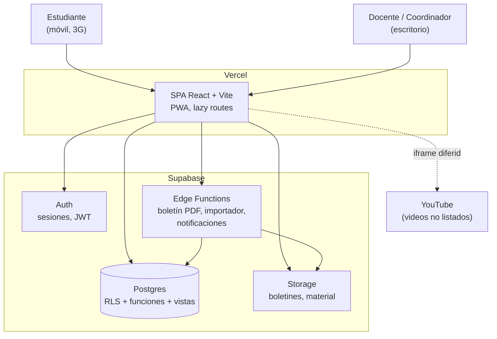
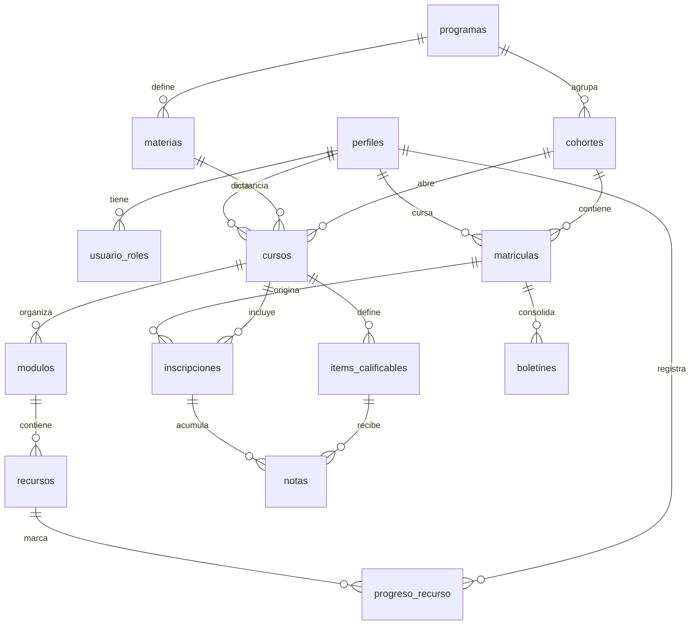

# Plataforma EduAcceso — Plan de desarrollo y ejecución

**Versión:** 1.3 · agosto de 2026 — incorpora la guía de asignatura y el calendario reales: ponderación de dos niveles, habilitaciones y materias secuenciales
**Stack decidido:** React + Vite + TypeScript + Tailwind · Supabase (Postgres, Auth, Storage, Edge Functions) · Vercel
**Referencia funcional:** Canvas LMS (estructura, no clonación de UI)

---

## 0. Cómo leer este plan

Está ordenado por **secuencia de ejecución real**, no por importancia teórica. Lo que va primero va primero porque bloquea lo que sigue o porque es caro de revertir después.

Dos conceptos que se repiten y conviene fijar desde ya:

- **Puerta de una vía:** decisión difícil o cara de revertir (modelo de datos, identidad, esquema de permisos). Se piensa antes, se documenta y se cambia poco.
- **Puerta de dos vías:** decisión reversible (color de un botón, librería de tablas, orden de un menú). Se decide rápido y se corrige sobre la marcha.

El 80% del riesgo de este proyecto está en tres puertas de una vía: **el modelo de datos académico, el esquema de identidad y permisos, y el reglamento de evaluación**. El resto es trabajo.

> **Supuestos activos.** Este plan asume respuestas a las preguntas de la sección 12. Donde un supuesto es fuerte, está marcado con ⚠. Si alguno resulta falso, el plan cambia — y está indicado dónde.

---

## 1. Contexto entendido

| Dimensión | Situación |
|---|---|
| Negocio | Formación propia (Bachillerato Acelerado + 20 técnicos laborales) en municipios de Meta, Casanare y Cundinamarca |
| Modalidad | A distancia. El material principal son videos alojados en YouTube |
| Usuarios v1 | 100–200 estudiantes, más docentes y coordinación |
| Escala 12–18 meses | ⚠ Se asume crecimiento a 500–800 estudiantes, no a decenas de miles |
| Equipo | 1 desarrollador. Esta es **la restricción dominante del proyecto** |
| Conectividad | Móvil rural, datos prepago, dispositivos de gama media-baja |
| Catálogo | ~250 materias distribuidas en 20 programas × 3 periodos |
| Presupuesto infra | Bajo. Objetivo: mantenerse por debajo de USD 50/mes en v1 |

### Decisiones cerradas

| Decisión | Valor | Impacto |
|---|---|---|
| Alcance v1 | Solo programas propios | Modelo de datos de un solo contexto (ver 1.1) |
| Escala de calificación | **1.0 a 5.0, un decimal** (3.5, 3.8, 3.9) | `numeric(2,1)` con `CHECK (valor BETWEEN 1.0 AND 5.0)` |
| Estructura de periodos | Técnicos: 3 cuatrimestres · Bachillerato Acelerado: **2 periodos de 6 meses** | Se modela como dato (`periodos_programa`), no como `if` por tipo |
| Nota mínima aprobatoria | **3.0** | Columna en `programas`, no constante en código |
| Cortes y pesos | **30% / 30% / 40%**; el tercero incluye el 15% del examen final | `componentes_evaluacion.corte` |
| Ponderación interna | Unidad: **Actividad 70% + Quiz 30%** | Ponderación de dos niveles (ver `adr/0006`) |
| Habilitación | Definitiva entre **2.0 y 2.9**, tope **3.0**, sobre la **definitiva completa**, conservando la nota más alta | Tabla `habilitaciones` + vista `v_nota_efectiva` |
| Estructura de evaluación | Obligatoria e igual para todas las materias, vía **plantilla copiada al curso** y editable por coordinación | Tablas `plantillas_evaluacion` (ver `adr/0007`) |
| Dictado de materias | **Secuencial**: 5 materias de 3 semanas por cuatrimestre, una unidad por semana | `cursos.inicia_el` / `termina_el`; el dashboard destaca la materia activa |
| Captura de notas | **Cada docente en su curso** | Modelo de permisos y estados de cierre (ver 5.2 y fase 4) |

### La tensión que hay que resolver antes de codificar

El landing corporativo (eduaccesosas.com) presenta a EduAcceso como **asesoría universitaria**: convenios con universidades aliadas, modelo de financiación 40/60, aliado Markplus, prácticas y empleabilidad. El proyecto que vamos a construir es un **LMS para formación propia**.

Son dos negocios distintos con datos distintos:

- **Contexto A — Formación propia:** programa → periodo → materia → notas → boletín.
- **Contexto B — Asesoría universitaria:** prospecto → trámite → universidad aliada → cartera 40/60 → práctica → empleo.

**DECIDIDO: la v1 cubre solo el Contexto A.** Los estudiantes de asesoría universitaria y la cartera 40/60 quedan fuera del alcance.

Mezclarlos en el mismo modelo de datos habría sido el error de diseño más caro posible: "estudiante" significa cosas distintas en cada contexto y el ciclo de vida no coincide.

**La costura que sí se deja abierta** (cuesta casi nada hoy y ahorra una migración si algún día se unifican): `perfiles` guarda únicamente atributos de persona — nombre, documento, contacto — y **ningún campo específico de formación**. Todo lo académico cuelga de `matriculas` hacia abajo. Si el Contexto B llega después, se añade como módulo hermano sobre la misma tabla de personas, sin tocar lo académico.

---

## 2. Atributos de calidad, priorizados

El orden es lo que decide los trade-offs. Este es el orden propuesto:

| # | Atributo | Objetivo concreto | Qué se sacrifica por él |
|---|---|---|---|
| 1 | **Integridad del dato académico** | Cero notas perdidas o alteradas sin rastro. Toda escritura sobre notas queda auditada | Velocidad de desarrollo: más constraints, más pruebas |
| 2 | **Seguridad y aislamiento** | Un estudiante jamás ve datos de otro. Verificado por pruebas automáticas, no por confianza | Simplicidad: RLS en todas las tablas cuesta trabajo |
| 3 | **Mantenibilidad por una sola persona** | Cualquier cambio comprensible en 6 meses sin releer todo | Sofisticación: nada de arquitecturas "elegantes" |
| 4 | **Rendimiento percibido en 3G** | Dashboard usable en <2.5 s en red lenta; p95 de API <500 ms | Riqueza visual: sin animaciones pesadas ni imágenes grandes |
| 5 | **Time-to-market** | Piloto real con una cohorte en ~10 semanas | Alcance: se recorta funcionalidad, no calidad |
| 6 | Disponibilidad | 99% es suficiente. No es un sistema de pagos | Redundancia: sin multi-región, sin failover |
| 7 | Escalabilidad | Postgres con buenos índices aguanta 10.000 estudiantes | Nada relevante a esta escala |

**Lo que explícitamente NO se optimiza en v1:** tiempo real, offline completo, internacionalización, multi-tenant, alta disponibilidad. Cada uno de estos añadido "por si acaso" cuesta semanas y no lo pide nadie.

---

## 3. Arquitectura: monolito modular sobre Supabase

### 3.1 La decisión

Una sola aplicación React desplegada en Vercel, hablando con un único proyecto Supabase. Lógica de negocio sensible en Postgres (RLS + funciones) y en Edge Functions. Sin microservicios, sin backend propio, sin ORM pesado.

**Por qué:** con un solo desarrollador, la carga operativa es el recurso escaso. Cada servicio adicional es un despliegue, un log, un secreto y un modo de fallo más. El sistema completo cabe en la cabeza de una persona, y esa es una propiedad que vale más que cualquier patrón.

### 3.2 Los tres módulos del dominio

Separados por carpeta y por esquema mental, no por despliegue:

```
academico/     catálogo, cohortes, matrícula, cursos
contenido/     módulos, recursos, videos, anuncios
evaluacion/    ítems calificables, notas, boletines
```

La regla que los mantiene sanos: **`contenido` y `evaluacion` dependen de `academico`; nunca al revés.** Es verificable en CI (ver 10.2) y es la costura que permitiría extraer un servicio en el futuro si alguna vez hiciera falta.

### 3.3 Diagrama de contenedores



**Nota sobre YouTube:** el video no se descarga a través de nuestra infraestructura. Eso elimina el costo más grande de un LMS y también su mayor riesgo de rendimiento. A cambio, dependemos de la disponibilidad de YouTube y de que los videos estén en modo **no listado** (los privados no se pueden incrustar).

---

## 4. Modelo de datos — la decisión más cara de revertir

### 4.1 El concepto central: `curso` como instancia

El error clásico es colgar las notas de `estudiante` + `materia`. Se rompe el primer día en que alguien repite una materia, cambia de cohorte u homologa.

La estructura correcta separa **definición** de **instancia**:

- `materia` = lo que dice el pensum ("Matemáticas I del técnico en Electricidad, periodo 1"). Se define una vez.
- `curso` = esa materia dictada a una cohorte concreta en un periodo concreto, con un docente. Se crea cada vez que se abre.
- `inscripcion` = un estudiante dentro de un curso. **Las notas cuelgan de aquí.**

Es exactamente el modelo de Canvas (course / section / enrollment) y existe por esta razón. Cuesta una tabla más al principio y ahorra una migración de datos dolorosa después.

### 4.2 Esquema



### 4.3 Tablas y por qué cada una

| Tabla | Contenido | Decisión de diseño |
|---|---|---|
| `perfiles` | Datos de la persona, enlazada 1:1 con `auth.users` | Nunca guardar datos personales en `auth.users`; ahí solo va la identidad |
| `usuario_roles` | `(usuario_id, rol)` con rol ∈ estudiante, docente, coordinador, admin | Tabla aparte, no columna: una persona puede ser docente y coordinador |
| `programas` | Los 20 técnicos + Bachillerato Acelerado | `tipo` distingue la lógica de periodos entre ambos |
| `materias` | El pensum: nombre, periodo (1..n), orden, intensidad | Es catálogo. No cambia por cohorte |
| `cohortes` | "Puerto López 2026-1": municipio, fecha inicio, periodo actual, estado | El periodo activo vive aquí, no en configuración global |
| `matriculas` | Estudiante ↔ cohorte, con estado (activa / retirada / graduada / aplazada) | Es el vínculo académico maestro. Nunca se borra |
| `cursos` | Instancia de materia para una cohorte y periodo, con docente | **La tabla bisagra.** Sin ella el modelo no sobrevive al segundo año |
| `inscripciones` | Estudiante dentro de un curso, con estado y `intento` | Permite repetir una materia sin destruir el histórico anterior |
| `modulos` | Unidades del curso, con `publicado` y `orden` | El docente arma en borrador y publica cuando está listo |
| `recursos` | Video YouTube, enlace o archivo, con `tipo` y `orden` | Un solo tipo polimórfico simple; no tres tablas |
| `items_calificables` | Qué se califica en el curso, con `peso` y `corte` | El esquema de evaluación es dato, no código |
| `notas` | Valor por `(item, inscripcion)`, con `publicada` y trazabilidad | `numeric(2,1)` con `CHECK (valor BETWEEN 1.0 AND 5.0)`. **`publicada` es obligatorio.** Sin él, el estudiante ve notas a medio digitar |
| `boletines` | Consolidado por matrícula y periodo + PDF generado | Se congela al emitirse: es un documento, no una consulta |
| `anuncios` | Mensajes a nivel de curso o cohorte | |
| `progreso_recurso` | Marca de visto por estudiante y recurso | Alimenta la barra de avance sin depender de YouTube |
| `autorizaciones_datos` | Consentimiento Ley 1581: versión, fecha, si es menor y su acudiente | Requisito legal, no opcional |
| `auditoria` | Quién cambió qué nota, cuándo, valor anterior y nuevo | La diferencia entre un sistema académico y una app de notas |

### 4.4 Reglas duras del esquema

1. **Nada se borra.** Registros académicos usan `estado` y `eliminado_en`. Un `DELETE` sobre una nota es un incidente, no una operación.
2. **Integridad en la base, no en React.** Foreign keys, `CHECK` sobre el rango de notas, `UNIQUE (item_id, inscripcion_id)`. El frontend valida para dar buena experiencia; la base valida para garantizar verdad.
3. **Los promedios se calculan en Postgres**, en vistas o funciones. Si el cálculo vive en el cliente, dos pantallas mostrarán números distintos el día que una se olvide de actualizar.
   - **Las notas se guardan como `numeric(2,1)`, jamás como `float` o `double precision`.** En coma flotante, un 3.85 se almacena como 3.84999… y aparece redondeado hacia abajo en el boletín. Es un bug invisible en pruebas y una reclamación real en producción.
   - **El promedio se calcula con precisión completa y se redondea una sola vez, al final.** Redondear cada corte antes de promediar acumula error: tres notas de 3.45 redondeadas a 3.5 dan 3.5, pero el promedio real es 3.45. Con una nota aprobatoria de por medio, esa diferencia decide si alguien pierde la materia.
   - El rango de la escala, la nota mínima aprobatoria y la política de redondeo viven en la tabla `programas`, no incrustadas en el código.
4. **Índice en cada foreign key**, más compuestos en los caminos calientes: `(curso_id, estudiante_id)`, `(inscripcion_id, item_id)`, `(cohorte_id, estado)`. Postgres no los crea solo, y a 200 estudiantes no se nota — a 2.000 sí.
5. **Toda migración es un archivo SQL versionado en el repo.** Ningún cambio de esquema se hace clicando en el panel de Supabase. Esta regla es lo que hace posible tener un entorno de pruebas confiable.
6. **`timestamptz` siempre**, nunca `timestamp`. Y una sola zona de referencia: `America/Bogota`.

---

## 5. Seguridad — de diseño, no de auditoría

### 5.1 Identidad: la decisión práctica

⚠ Supuesto fuerte: **buena parte de los estudiantes no tiene un correo electrónico que revise.** Si es así, exigir email para iniciar sesión genera soporte permanente.

| Opción | A favor | En contra |
|---|---|---|
| Correo + contraseña | Recuperación automática, estándar | Muchos no tienen correo o lo olvidan |
| **Documento + contraseña** (correo sintético interno) | Todos saben su cédula. Cero fricción de alta | Recuperación de contraseña **manual**, por coordinación |
| Enlace mágico por WhatsApp | Sin contraseñas | No es nativo en Supabase; hay que construirlo y mantenerlo |

**Recomendación para v1: identidad mixta.**

- **Estudiantes: documento + contraseña.** Contraseña temporal entregada en la matrícula, cambio obligatorio en el primer ingreso. Correo opcional para quien lo tenga — y a esos sí se les habilita recuperación automática.
- **Docentes: correo + contraseña.** Como cada docente ahora carga las notas de su propio curso, son cuentas críticas y con uso frecuente. Un docente sí tiene correo, y eso te ahorra ser tú quien restablezca contraseñas cada semana.

Que ambos esquemas convivan no complica el modelo: internamente todo es una cuenta de Auth; lo único que cambia es cómo se genera el identificador de acceso.

**MFA obligatorio para roles admin y coordinador.** Son las cuentas que pueden alterar notas de todos.

### 5.2 RLS: el perímetro real

El cliente React usa la clave pública (`anon`). Eso es correcto y esperado: **la seguridad no está en esconder la clave, está en las políticas.** Reglas:

- RLS **habilitada en todas las tablas sin excepción**, con política por defecto de denegar.
- La `service_role` key jamás llega al navegador. Vive solo en Edge Functions.
- Las políticas que necesitan consultar otras tablas usan funciones `SECURITY DEFINER` con `search_path` fijo. Si una política consulta directamente una tabla que a su vez tiene RLS, se produce recursión — es el error más común y aparece como un timeout misterioso.

Modelo de acceso resumido:

| Rol | Puede leer | Puede escribir |
|---|---|---|
| Estudiante | Solo sus matrículas, sus inscripciones, sus notas **publicadas**, y el contenido publicado de sus cursos | Solo su progreso de recursos y su perfil |
| Docente | Sus cursos asignados y los estudiantes inscritos en ellos | Contenido y notas **solo de sus cursos, y solo mientras el periodo esté abierto** |
| Coordinador | Su cohorte / sede completa | Matrículas, cursos, notas de su ámbito |
| Admin | Todo | Todo, con auditoría |

**Consecuencia directa de que cada docente cargue sus notas:** hacen falta **estados de cierre**. `cursos.estado` (borrador → abierto → cerrado) y `cohortes.periodo_estado` gobiernan la escritura. Cuando coordinación cierra el periodo, la política RLS deja de permitir escrituras de docentes sobre ese curso; solo un rol de coordinación puede modificar después, y cada cambio queda en `auditoria` con autor y valor anterior.

Sin esto, un docente podría alterar una nota semanas después de emitido el boletín, y el documento oficial dejaría de coincidir con la base de datos. Es el requisito que convierte esto en un sistema académico y no en una hoja de cálculo compartida.

### 5.3 La prueba que no es negociable

**Un conjunto de pruebas de aislamiento que se ejecuta en CI en cada push.** Crea dos estudiantes de cohortes distintas, autentica como el primero e intenta leer todo lo del segundo: notas, matrículas, cursos, recursos. Cada consulta debe devolver cero filas.

Sin esta prueba, la RLS se degrada silenciosamente: alguien añade una tabla, olvida la política, y nadie se entera hasta que un estudiante ve las notas de otro. Este test es la diferencia entre creer que el sistema es seguro y saberlo.

### 5.4 Ley 1581 — lo que aplica aquí

Esto no es papeleo: **hay menores de edad en Bachillerato Acelerado**, lo que sube el estándar.

- **Política de tratamiento publicada** y accesible desde la plataforma y desde el landing. El formulario del landing ya declara aceptarla; hay que verificar que exista realmente.
- **Autorización registrada** en `autorizaciones_datos`: versión aceptada, fecha, y para menores, identificación del representante legal que autoriza.
- **Minimización:** no pedir dato que no se use. Cada campo del formulario de matrícula debe justificar su existencia.
- **Derechos del titular:** poder localizar, exportar y anonimizar todos los datos de una persona sin cirugía. Se resuelve con `user_id` trazable y borrado en cascada bien definido.
- **Transferencia internacional:** los datos quedarán fuera de Colombia (infraestructura del proveedor cloud). Hay que documentarlo en la política y elegir la región más cercana al crear el proyecto — **la región no se cambia después.**
- **Encargado del tratamiento:** el proveedor de infraestructura actúa como encargado; corresponde documentar esa relación.

> Esto orienta el diseño, no sustituye asesoría jurídica. Antes de publicar la política conviene revisarla con alguien que ejerza derecho.

### 5.5 Otros controles

- Rate limiting en login y en recuperación de contraseña (Edge Function o el propio Auth).
- Storage privado con URLs firmadas de vida corta. Un boletín en un bucket público es una filtración esperando ocurrir.
- Secretos solo en variables de entorno de Vercel y Supabase. Escaneo de secretos en CI.
- Cabeceras de seguridad en Vercel: CSP, `X-Frame-Options`, `Referrer-Policy`.

---

## 6. Rendimiento — presupuesto explícito

Un objetivo sin número no es un objetivo. Estos son los presupuestos y se verifican en CI:

| Métrica | Presupuesto | Cómo se mide |
|---|---|---|
| LCP del dashboard en 3G simulada | < 2.5 s | Lighthouse CI en cada PR |
| Bundle JS inicial (gzip) | < 180 KB | Chequeo de tamaño en CI |
| p95 de consultas de lectura | < 300 ms | `pg_stat_statements` |
| Consultas por carga del dashboard | ≤ 3 | Revisión en desarrollo |

### Tácticas concretas

**Base de datos**
- Una función RPC `dashboard_estudiante()` que devuelve todo lo de la pantalla en **una sola llamada**. Es la diferencia entre 12 peticiones y 1 en una red con 300 ms de latencia.
- Vistas materializadas para promedios por cohorte, refrescadas al publicar notas. No recalcular en cada carga.
- Paginación obligatoria en cualquier listado. Nunca `select *` sin límite.
- Usar el pooler de conexiones: en serverless, abrir conexiones directas agota Postgres rápido.

**Frontend**
- **Fachada para YouTube:** mostrar la miniatura y cargar el `iframe` solo al hacer clic. Un `iframe` de YouTube arrastra cerca de 1 MB; con seis videos en una página, la vista es inusable en 3G. Esta sola decisión es la de mayor impacto en el contexto rural.
- `youtube-nocookie.com` como dominio de incrustación.
- Rutas con carga diferida por rol: el estudiante nunca descarga el código del panel administrativo.
- PWA con caché del shell y de los datos del cuatrimestre activo. No offline completo — solo que abrir la app dos veces no cueste datos dos veces.
- Sin librería de componentes pesada. Tailwind + componentes propios.
- Una sola fuente, subconjunto latino, o directamente fuentes del sistema.

**Lo que NO se hace:** Realtime (nadie necesita ver una nota aparecer en vivo), SSR (no aporta en una app tras login), ni caché distribuida (Postgres a esta escala responde en milisegundos).

---

## 7. Las fases

Cada fase tiene un **criterio de salida verificable**. Si no se cumple, no se avanza — arrastrar deuda entre fases es cómo estos proyectos se estiran al doble.

Las duraciones asumen ⚠ dedicación de medio tiempo de una persona.

---

### Fase 0 — Cimientos y descubrimiento · ~1 semana · sin código de producto

Lo más rentable del proyecto entero. Se hace antes de escribir una línea de la aplicación.

**Trabajo**
1. **Cerrar lo que falta del reglamento de evaluación.** La escala ya está definida (1.0–5.0). Falta: **nota mínima aprobatoria**, número de cortes por periodo y sus pesos, política de redondeo (¿uno o dos decimales?, ¿cómo se resuelve un 2.995?), y si existen habilitaciones o supletorios. Todo esto se vuelve estructura de datos; descubrirlo en la fase 4 obliga a migrar notas ya cargadas.
2. **Conseguir el formato oficial de boletín** que hoy se emite. En papel, escaneado, como sea.
3. **Probar el flujo de notas en planilla durante un corte real.** Si coordinación no logra llenar una hoja de cálculo a tiempo, el software no lo arregla — lo hace más visible. Este experimento cuesta cero y puede cambiar todo el plan.
4. **Normalizar el pensum a CSV**: programa, periodo, materia, orden. A partir de las fotos del pensum. Es el insumo del importador.
5. Redactar la política de tratamiento de datos.
6. Montar repositorio, dos proyectos Supabase (pruebas y producción), CI base y el flujo `dev → main`.

**Criterio de salida:** existe un CSV validado del pensum, un documento de una página con las reglas de evaluación firmado por coordinación, y `main` despliega un "hola mundo" en Vercel automáticamente.

---

### Fase 1 — Esqueleto vertical · ~1.5 semanas

Una rebanada delgada que atraviesa **todas** las capas: un estudiante real inicia sesión, ve un curso real, con un video real y una nota real. Una sola materia, una sola cohorte.

**Por qué primero:** integrar es donde aparecen las sorpresas. Construir el ancho antes de haber atravesado el alto es cómo se descubre en la semana 8 que el modelo de identidad no funciona.

**Trabajo**
- Migración inicial con las tablas núcleo y RLS activa desde el primer commit — no "se activa después", porque después significa nunca.
- Auth con documento + contraseña, cambio obligatorio en el primer ingreso.
- Layout base, rutas por rol, sesión persistente.
- Las pruebas de aislamiento (5.3) corriendo en CI.
- Semilla con datos anonimizados de una cohorte ficticia.

**Criterio de salida:** un estudiante de prueba entra desde un celular, ve su materia con su video y su nota; otro estudiante no puede ver nada de él, y eso está demostrado por una prueba automática en verde.

---

### Fase 2 — Catálogo académico y matrícula · ~2 semanas

Sin datos cargados no hay plataforma. Este es el trabajo pesado y poco vistoso.

**Trabajo**
- CRUD de programas, materias, cohortes.
- **Importador CSV** de pensum y de estudiantes, con validación previa, reporte de errores y modo simulación antes de escribir. Cargar 250 materias y 200 estudiantes a mano no es viable.
- Apertura de cursos: seleccionar cohorte y periodo, generar los cursos del periodo, asignar docentes.
- Matrícula e inscripción automática de estudiantes a los cursos de su periodo.
- Panel de coordinación.

**Criterio de salida:** el pensum completo y una cohorte real están cargados desde CSV, con los cursos del periodo 1 abiertos y los estudiantes inscritos. Cero registros digitados a mano.

---

### Fase 3 — Portal del estudiante · ~2 semanas

La cara visible. Es donde se juega la adopción.

**Trabajo**
- Dashboard: materias del periodo activo, avance, próximos cortes, anuncios recientes. Una sola llamada RPC.
- Vista de curso: módulos, recursos, videos con fachada diferida, material descargable, enlaces.
- Marca de progreso por recurso.
- Anuncios y horario.
- Perfil del estudiante.
- Panel del docente para armar módulos y publicar contenido.
- PWA instalable.

**Criterio de salida:** cinco estudiantes reales navegan la plataforma desde sus celulares en un municipio, con conexión real, y completan sin ayuda: entrar, encontrar su materia, ver un video, descargar material. Se mide el LCP en esos dispositivos, no en el simulador.

---

### Fase 4 — Evaluación y boletines · ~2 semanas

El módulo más delicado del sistema. Aquí es donde una falla tiene consecuencias legales, no solo molestias.

**Trabajo**
- Definición del esquema de evaluación por curso: ítems, pesos, cortes.
- **Planilla del docente**: captura de notas de su curso en una sola pantalla tipo hoja de cálculo, agrupada por componente (Unidad 1, Unidad 2, Unidad 3, Examen Final) tal como aparece en la guía de asignatura impresa, con guardado en borrador, navegación por teclado y **publicación explícita**. Es la pantalla que más se va a usar del sistema entero; merece más cuidado de diseño que el resto.
- **Registro de habilitaciones**: autorización por coordinación cuando la definitiva cae entre 2.0 y 2.9, captura de la nota, aplicación del tope de 3.0 y visualización de las tres notas (original, habilitación, resultante).
- Estados de cierre de curso y periodo (ver 5.2), con bloqueo de escritura al cerrar.
- **Tablero de avance para coordinación**: qué cursos ya tienen notas cargadas y cuáles no, por corte. Con docentes distribuidos, perseguir notas sin este tablero es imposible.
- Cálculo de promedios en la base de datos, con las reglas de la fase 0.
- Vista de notas del estudiante: solo lo publicado, con desglose por ítem.
- Generación del boletín en PDF vía Edge Function, almacenado y firmado.
- Auditoría de toda escritura de notas, consultable por coordinación.

**Criterio de salida:** un docente real —no tú— carga las notas de un corte completo desde su propio computador y sin acompañamiento, las publica, el estudiante las ve, y el boletín generado **coincide exactamente** con el formato oficial de la fase 0. Al cerrar el periodo, ese mismo docente ya no puede modificarlas, y cualquier cambio hecho por coordinación queda registrado con autor y valor anterior.

---

### Fase 5 — Piloto controlado · ~2 semanas

**Una sola cohorte, 20–30 estudiantes, un periodo real.** No un despliegue general.

**Trabajo**
- Guía de uso corta (una página) y un video de dos minutos, **una versión para estudiantes y otra para docentes**.
- Sesión de acompañamiento con los docentes del piloto durante el primer corte real. Es el grupo cuyo fallo detiene el sistema completo.
- Canal de soporte definido, con responsable nombrado.
- Instrumentación: qué se usa, dónde se abandona, qué falla.
- Corrección de lo que aparezca. Y aparecerá.

**Criterio de salida:** el periodo cierra dentro de la plataforma, con boletines emitidos y menos de una incidencia de soporte por estudiante. Si el volumen de soporte se dispara, el problema está en el diseño y hay que corregirlo antes de escalar.

---

### Fase 6 — Endurecimiento y despliegue general · ~1.5 semanas

**Trabajo**
- Respaldos verificados: **restaurar de verdad en un proyecto limpio.** Un respaldo no probado no es un respaldo.
- Alertas: errores en producción, fallos de login masivos, fallos en generación de boletines.
- Revisión de índices con datos reales y `pg_stat_statements`.
- Documentación de operación: cómo abrir un periodo, cómo matricular, cómo restaurar, qué hacer si Supabase cae.
- Migración del resto de cohortes.

**Criterio de salida:** existe un documento con el que otra persona podría operar el sistema, y un respaldo restaurado con éxito en un entorno limpio.

---

### Fases posteriores — por demanda, no por defecto

Nada de esto entra hasta que el piloto lo pida con datos:

| Módulo | Cuándo tiene sentido |
|---|---|
| Entrega de tareas | Si los docentes hoy reciben trabajos por WhatsApp y se pierden |
| Evaluaciones en línea | Si la evaluación por formularios externos resulta insostenible |
| Notificaciones por WhatsApp | Alto valor y bajo costo con la Cloud API. Probablemente el mejor primer añadido |
| Certificados y constancias | Cuando el primer grupo esté por graduarse |
| Cartera 40/60 | Solo si se decide unificar con el Contexto B |

---

## 8. Cronograma consolidado

| Fase | Duración | Acumulado |
|---|---|---|
| 0 · Cimientos | 1 sem | 1 |
| 1 · Esqueleto vertical | 1.5 sem | 2.5 |
| 2 · Catálogo y matrícula | 2 sem | 4.5 |
| 3 · Portal del estudiante | 2 sem | 6.5 |
| 4 · Evaluación y boletines | 2.5 sem | 9 |
| 5 · Piloto | 2 sem | 11 |
| 6 · Endurecimiento | 1.5 sem | **12.5 semanas** |

⚠ A medio tiempo y sin interrupciones. La media semana adicional de la fase 4 corresponde a la planilla del docente y a los estados de cierre. En la práctica, con clientes en paralelo, **presupuestar 16 semanas** y comunicarlo así desde el principio. Prometer 12 y entregar en 16 destruye más confianza que prometer 16 y entregar en 14.

---

## 9. Entornos, despliegue y datos

- **Tres entornos:** local (Supabase CLI), pruebas (proyecto Supabase separado), producción (proyecto Supabase en plan de producción, con respaldos).
- **Ramas:** `dev` → previews automáticos en Vercel; `main` → producción. Sin excepciones ni despliegues manuales.
- **Migraciones versionadas** en el repo, aplicadas por CI. Prohibido el cambio de esquema desde el panel.
- **Datos de prueba anonimizados.** Nunca copiar la base de producción a pruebas con nombres y documentos reales: eso convierte el entorno de pruebas en un problema de protección de datos.
- **Respaldos:** los diarios del plan de producción, **más** un volcado lógico semanal a almacenamiento externo. Una ventana de siete días es corta para registros académicos, y la retención larga suele ser un costo adicional.

---

## 10. Cómo se evita que el diseño se degrade

### 10.1 Observabilidad mínima desde el día 1
Logs estructurados en Edge Functions, captura de errores del frontend, tabla de auditoría consultable, y un monitor de disponibilidad externo. Alertas sobre: errores de publicación de notas, fallos de generación de boletín, y picos de fallos de autenticación.

### 10.2 Funciones de aptitud — verificaciones automáticas en CI

Estas cuatro pruebas mantienen vivas las decisiones de este documento cuando ya nadie recuerde por qué se tomaron:

1. **Ninguna tabla sin RLS.** Consulta al catálogo de Postgres; falla el build si aparece una tabla nueva sin política.
2. **Aislamiento entre estudiantes.** El test de la sección 5.3.
3. **Presupuesto de rendimiento.** Lighthouse CI sobre el dashboard; falla si LCP o tamaño de bundle exceden lo pactado.
4. **Dirección de dependencias.** `evaluacion` y `contenido` pueden importar de `academico`; lo contrario rompe el build.

---

## 11. Riesgos priorizados

| Riesgo | Impacto | Prob. | Mitigación |
|---|---|---|---|
| Reglamento de evaluación mal entendido | **Alto** — obliga a migrar notas ya cargadas | Media | Congelarlo en fase 0, por escrito y firmado |
| **Docentes no cargan notas a tiempo** | Alto — la plataforma queda vacía y pierde credibilidad | **Alta** | Es el riesgo #1 tras decidir captura distribuida: tablero de avance para coordinación, recordatorios automáticos y acompañamiento en el primer corte |
| Política RLS mal escrita | **Alto** — fuga de datos de menores | Media | Pruebas de aislamiento en CI, no revisión manual |
| Un solo desarrollador | Alto — el proyecto se congela | Media | Documentación operativa y migraciones versionadas desde el día 1 |
| Docente con bajo manejo tecnológico | Medio — notas cargadas mal o no cargadas | Media | Planilla con navegación por teclado, importación desde Excel como alternativa, acompañamiento en fase 5 |
| Rendimiento en 3G peor de lo previsto | Medio — abandono de estudiantes | Media | Fachada de YouTube, medición en dispositivos reales en fase 3 |
| Crecimiento del alcance | Medio — se estira el cronograma | **Alta** | Alcance cerrado por fase; lo nuevo entra a la lista de fases posteriores |
| Videos de YouTube en modo privado | Bajo pero bloqueante | Media | Verificar en fase 0: deben ser **no listados**, no privados |

---

## 12. Preguntas abiertas que cambian este plan

Ordenadas por cuánto cuesta responderlas tarde:

**Resueltas:** alcance de la v1 (solo programas propios), escala de calificación (1.0–5.0 con un decimal), responsable de la captura de notas (cada docente en su curso) y estructura de periodos (técnicos 3 cuatrimestres; bachillerato 2 periodos de 6 meses).

**Pendientes, ordenadas por cuánto cuesta responderlas tarde:**

1. **¿Cuál es la nota mínima APROBATORIA?** 1.0 es el piso de la escala, no el umbral de aprobación — son cosas distintas. En Colombia lo habitual es 3.0, pero hay que confirmarlo. Y con ello: ¿cuántos cortes tiene un periodo y con qué pesos? ¿Existen habilitaciones o supletorios? *Bloquea la fase 4 y define constraints de la fase 1.*
2. **¿Dentro de cada periodo de 6 meses del Bachillerato Acelerado hay cortes intermedios de calificación?** Se sabe que son 2 periodos de 6 meses, pero no cuántas veces se califica dentro de cada uno. *Bloquea la fase 4.*
3. **¿Cuántos docentes hay, cuántos cursos dicta cada uno y qué manejo tecnológico tienen?** Con captura distribuida, este dato define el diseño de la planilla y el esfuerzo de capacitación. *Bloquea el diseño de la fase 4.*
4. **¿Los estudiantes tienen correo electrónico propio y lo revisan?** Confirma o descarta el esquema de identidad mixta de 5.1.
5. **¿Existen datos históricos que migrar** (planillas de cohortes anteriores)? Si sí, es una fase adicional.
6. **¿Los videos de YouTube están como "no listados" o como "privados"?** Los privados no se pueden incrustar.
7. **¿Existe la política de tratamiento de datos** que el formulario del landing dice aceptar? Y para menores, ¿se recoge autorización del acudiente?

---

## 13. Por dónde empezar el lunes

1. Enviar a coordinación las preguntas 1, 2 y 3 de la sección anterior.
2. Pedir el formato oficial de boletín que se emite hoy.
3. Poner a coordinación a llevar las notas de un corte en una hoja de cálculo, empezando ya.
4. Crear repositorio, los dos proyectos Supabase y el CI base.
5. Transcribir el pensum a CSV.

Nada de esto requiere haber decidido un solo detalle de la interfaz — y todo bloquea lo que viene después.
